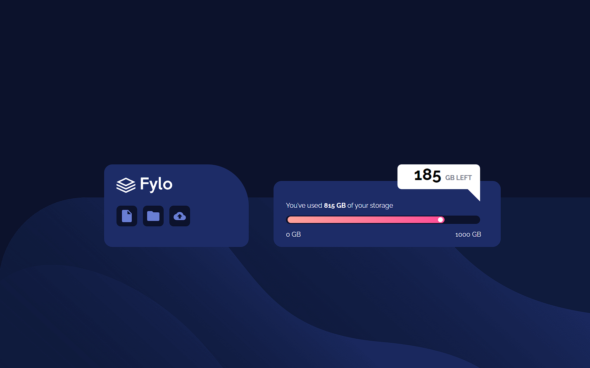

# Frontend Mentor - Fylo data storage component solution

This is a solution to the [Fylo data storage component challenge on Frontend Mentor](https://www.frontendmentor.io/challenges/fylo-data-storage-component-1dZPRbV5n). Frontend Mentor challenges help you improve your coding skills by building realistic projects. 

## Table of contents

- [Overview](#overview)
  - [The challenge](#the-challenge)
  - [Screenshot](#screenshot)
  - [Links](#links)
  - [Built with](#built-with)
  - [What I learned](#what-i-learned)
  - [Continued development](#continued-development)
- [Author](#author)


## Overview

### The challenge

Users should be able to:

- View the optimal layout for the site depending on their device's screen size

### Screenshot




### Links

- Solution URL: [Add solution URL here](https://github.com/informaticadiaz/-fylo-data-storage)
- Live Site URL: [Add live site URL here](https://informaticadiaz.github.io/-fylo-data-storage/)


### Built with

- Semantic HTML5 markup
- CSS custom properties
- Mobile-first workflow

### What I learned

Use root color

```CSS
:root {
  --Gradient1: hsl(6, 100%, 80%);
  --Gradient2: hsl(335, 100%, 65%);
  --Pale-Blue: hsl(243, 100%, 93%);
  --Grayish-Blue: hsl(229, 7%, 55%);
  --Dark-Blue: hsl(228, 56%, 26%);
  --Very-Dark-Blue: hsl(229, 57%, 11%);
}
```
Create triangle

```css
.box_rigth .triangulo {
  margin-left: 460px;
  margin-top: 10px;
  width: 0;
  height: 0;
  border-right: 20px solid white;
  border-top: 20px solid white;
  border-left: 20px solid transparent;
  border-bottom: 20px solid transparent;
}
```

Create gradient

```css
.box_storage .box_load2 {
  margin-top: -18px;
  margin-left: 4px;
  width: 220px;
  height: 16px;
  background-image: linear-gradient(
    to right,
    hsl(6, 100%, 80%),
    hsl(335, 100%, 65%)
  );
  border-radius: 10px;
}
.box_storage .box_load3 {
  margin-top: -14px;
  margin-left: 210px;
  width: 12px;
  height: 12px;
  border-radius: 16px;
  background-color: white;
}
```

### Continued development

Learn CSS

display, margin, padding, position,

object-fit

**Note: Delete this note and the content within this section and replace with your own plans for continued development.**

## Author

- Website - [Diaz Ignacio](https://www.diazignacio.ar)
- Frontend Mentor - [@informaticadiaz](https://www.frontendmentor.io/profile/informaticadiaz)
- Twitter - [@DiazIgnacioDev](https://twitter.com/DiazIgnacioDev)
